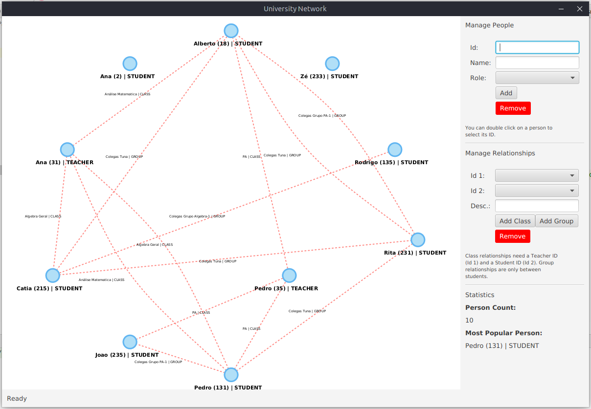
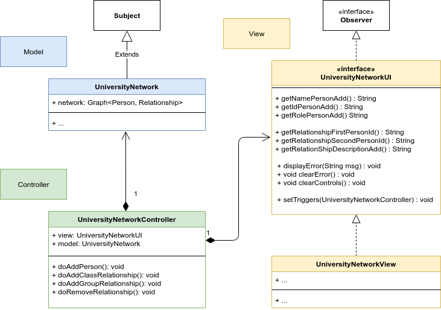

# Java Patterns - Model View Controller

This repository contains the code to create the following application:

## Architecture

The application is designed according to the MVC pattern:

## Exercises

1. Complete the code so the "*Statistics*" information is populated correctly.

2. Complete the method `public void clearControls()` que deverá "limpar" os controls: textfields e comboxs

4. Provide the code to allow **adding a new Person to the network**.

    - Check `setTriggers` in the *view* and `doAddPerson` in the *controller*.

5. Implement the functionality to **remove a person from the network**.

    - You must add functionality to *model*, *controller* and *view*.

6. Implement the code necessary to add to "*Statistics*" information about the list of persons isolated in the network.
    Note: You should create a new method in UniversityNetwork that return the list of isolated Persons
